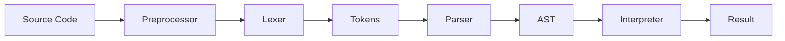
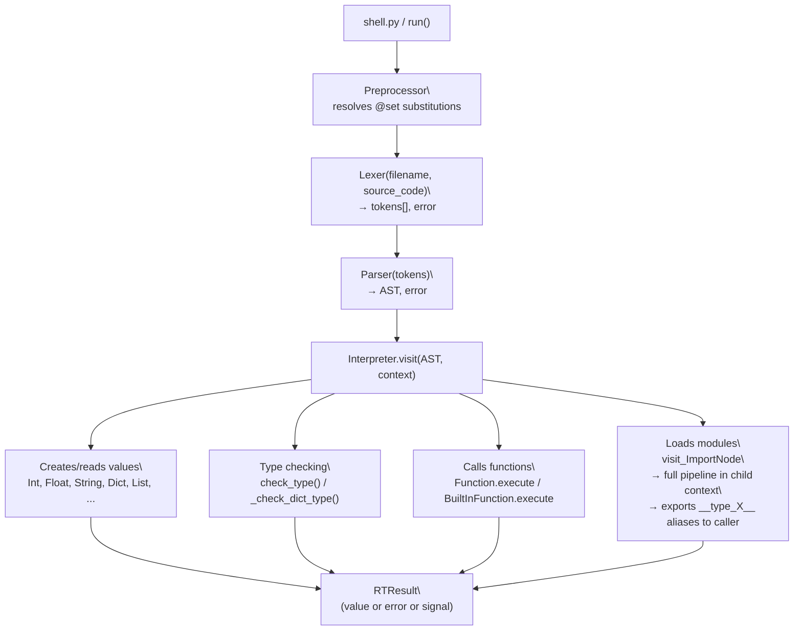

# Architecture

> Interpreter design and project structure

---

## Navigation

- [Documentation](Documentation.md) - syntax, types, functions, imports
- [Modules](Modules.md) - built-in modules
- [Linter](Linter.md) - static analysis, rules, config, and CLI
- [Tests](Tests.md) - test syntax, runner flags, and reports
- [Architecture (this page)](Architecture.md) - project structure and interpreter internals

---

## Contents

- [How the Interpreter Works](#how-the-interpreter-works)
- [Execution Stages](#execution-stages)
  - [1. Preprocessor](#1-preprocessor)
  - [2. Lexer](#2-lexer)
  - [3. Parser](#3-parser)
  - [4. Interpreter](#4-interpreter)
- [Project Structure](#project-structure)
- [Directory Overview](#directory-overview)
  - [src/main/](#srcmain)
  - [src/nodes/](#srcnodes)
  - [src/values/](#srcvalues)
  - [src/error/](#srcerror)
  - [src/run/](#srcrun)
  - [src/stdlib/](#srcstdlib)
  - [src/var/](#srcvar)
- [Data Flow](#data-flow)
- [Type System Internals](#type-system-internals)
- [Module System](#module-system)

---

## How the Interpreter Works

OmiLang is an interpreted language. Source code is not compiled to machine code or bytecode; it is processed directly in four stages:



---

## Execution Stages

### 1. Preprocessor

**File:** `src/preprocessor.py`

The preprocessor runs **before** the lexer and handles `@set` directives. It performs text-level substitution: it scans for `@set NAME as VALUE` lines, then rewrites later lines by replacing `NAME` with `VALUE` (or the reverse — depending on direction).

This enables:
- Aliases for keywords: `@set var as let` → `let` becomes `var`
- Aliases for symbols/functions: `@set sys.exec as shell` → `shell` becomes `sys.exec`
- Renaming module types: `@set m.PersonType as Person`

The preprocessor skips string literals and comments during substitution.

### 2. Lexer

**File:** `src/main/lexer.py`

The lexer splits source text into **tokens** — the smallest meaningful language units.

Example: `var<int?> x = 10 + 5` becomes:

```
[KEYWORD:var] [LT] [IDENTIFIER:int] [QUESTION] [GT] [IDENTIFIER:x] [EQ] [INT:10] [PLUS] [INT:5] [EOF]
```

Token types are defined in `src/var/token.py`:

| Token | Meaning |
|-------|---------|
| `TT_INT`, `TT_FLOAT` | Number literals |
| `TT_STRING`, `TT_FSTRING` | String / f-string literals |
| `TT_IDENTIFIER` | Variable/function/type names |
| `TT_KEYWORD` | Language keywords |
| `TT_PLUS`, `TT_MINUS`, `TT_MUL`, `TT_DIV`, `TT_POW` | Arithmetic |
| `TT_EQ`, `TT_EE`, `TT_NE`, `TT_LT`, `TT_GT`, `TT_LTE`, `TT_GTE` | Assignment / comparisons |
| `TT_LPAREN`, `TT_RPAREN` | Parentheses |
| `TT_LSQUARE`, `TT_RSQUARE` | Square brackets |
| `TT_LBRACE`, `TT_RBRACE` | Curly braces |
| `TT_COMMA`, `TT_COLON`, `TT_ARROW`, `TT_DOT`, `TT_AT` | Separators |
| `TT_TILDE` | `~` (ternary / f-string interpolation) |
| `TT_PIPE` | `\|` (union type separator) |
| `TT_QUESTION` | `?` (nullable type suffix) |
| `TT_NULLCOAL` | `??` (null coalescing operator) |
| `TT_NEWLINE`, `TT_E0F` | Control tokens |

**F-string lexing** (`make_string`): the lexer tracks nesting depth inside `~(...)` expressions and correctly handles nested string literals (e.g. `"~(dict["key"])"` ). This allows arbitrary expressions, including subscript access, inside interpolated strings.

Keywords (`src/var/keyword.py`):
```
var, const, and, or, is, isnt, if, elif, else, try, catch,
final, match, case, for, to, step, while, async, defer, func, end,
return, continue, break, import, as, use, set, type, enum, trait
```

### 3. Parser

**File:** `src/main/parser/parser.py`

The parser builds an **Abstract Syntax Tree (AST)** from the token stream using recursive descent parsing.

Precedence hierarchy (lowest → highest):

| Level | Method | Parses |
|-------|--------|--------|
| 1 | `expr()` | `var x = ...`, `??`, logical `and` / `or` |
| 2 | `comp_expr()` | Comparisons `==`, `!=`, `<`, `>`, `<=`, `>=`, `is`/`isnt` |
| 3 | `arith_expr()` | `+`, `-` |
| 4 | `term()` | `*`, `/` |
| 5 | `factor()` | Unary `+`, `-` |
| 6 | `power()` | `^` |
| 7 | `call()` | Calls `f()`, dot access `m.x`, subscript `d["k"]` |
| 8 | `atom()` | Numbers, strings, identifiers, `(...)`, `[...]`, `{...}`, `if`, `for`, `while`, `func` |

**Type annotation parsing** (`parse_type_annotation`, `_parse_dict_type_def`):
- `<int>` — simple type
- `<int | string>` — union type
- `<int?>` — nullable shorthand (desugars to `int | null`)
- `<m.PersonType>` — qualified alias from a module
- `type T = { key<type>, opt<string?>, nested: {...} }` — structured dict type

AST node classes are in `src/nodes/`:

| Node | File | Description |
|------|------|-------------|
| `NumberNode` | `types/number.py` | Numeric literal |
| `StringNode` | `types/string.py` | String literal |
| `FStringNode` | `types/fstring.py` | F-string with interpolated parts |
| `ListNode` | `types/list.py` | Array literal `[...]` |
| `DictNode` | `types/dict.py` | Dict literal `{...}` |
| `TypeAnnotationNode` | `types/typeannotation.py` | Type annotation (union, literal, alias) |
| `DictTypeAnnotation` | `types/typeannotation.py` | Structured dict type `{ key<type>, ... }` |
| `DictSubscriptNode` | `types/subscript.py` | Subscript access `d["key"]` |
| `BinOpNode` | `ops/binop.py` | Binary operation `a + b` |
| `UnaryOpNode` | `ops/unaryop.py` | Unary operation `-x`, `is`, `isnt` |
| `TernaryOpNode` | `ops/ternaryop.py` | Ternary `v ~ cond ~ alt` |
| `NullCoalNode` | `ops/nullcoal.py` | Null coalescing `a ?? b` |
| `VarAccessNode` | `variables/access.py` | Variable read |
| `VarAssignNode` | `variables/assign.py` | Variable declaration / assignment |
| `IfNode` | `condition/ifN.py` | `if/elif/else` |
| `ForNode` | `loops/forN.py` | `for` loop |
| `WhileNode` | `loops/whileN.py` | `while` loop |
| `FuncDefNode` | `function/funcdef.py` | Function definition |
| `CallNode` | `function/call.py` | Function call |
| `AwaitNode` | `function/awaitN.py` | Async-await form via `async <futureExpr>` |
| `TryNode` | `control/flow.py` | `try` block |
| `MatchNode` | `control/flow.py` | `match` expression |
| `CaseNode` | `control/flow.py` | `case` branch |
| `DeferNode` | `control/flow.py` | `defer` cleanup statement |
| `ReturnNode` | `jump/returnN.py` | `return` |
| `BreakNode` | `jump/breakN.py` | `break` |
| `ContinueNode` | `jump/continueN.py` | `continue` |
| `ImportNode` | `imports/importN.py` | `@import "..." as ...` |
| `ModuleAccessNode` | `imports/moduleaccess.py` | Dot access `module.member` |
| `TypeAliasNode` | `directives/typealiasN.py` | `type Name = ...` |
| `UseDirectiveNode` | `directives/useN.py` | `@use flag` |
| `SetDirectiveNode` | `directives/setN.py` | `@set ... as ...` |
| `EnumDefNode` | `types/enumdef.py` | `enum Name = { ... }` |
| `TraitDefNode` | `types/traitdef.py` | `trait Name = { ... }` |

### 4. Interpreter

**File:** `src/main/interpret.py`

The interpreter walks the AST and executes each node via `visit_*` methods:

| Visit method | Action |
|---|---|
| `visit_NumberNode` | Returns an `Int` or `Float` value |
| `visit_StringNode` | Returns a `String` |
| `visit_FStringNode` | Evaluates each interpolated part, concatenates |
| `visit_DictNode` | Builds a `Dict` from evaluated key/value pairs |
| `visit_DictSubscriptNode` | Looks up a key in `Dict` or index in `List` |
| `visit_BinOpNode` | Evaluates operands, applies operator |
| `visit_NullCoalNode` | Returns left if not null/void, else evaluates right |
| `visit_VarAssignNode` | Evaluates value, runs type check, stores in symbol table |
| `visit_FuncDefNode` | Creates `Function` value, stores in symbol table |
| `visit_CallNode` | Resolves callee, binds arguments, executes body |
| `visit_ImportNode` | Loads stdlib or file module, exports type aliases to caller |
| `visit_ModuleAccessNode` | Calls `get_member()` on `Module` or `Dict` |
| `visit_TypeAliasNode` | Stores `__type_Name__` in symbol table |
| `visit_EnumDefNode` | Stores the enum annotation and variant constructors/values |
| `visit_TraitDefNode` | Stores `__trait_Name__` in symbol table |

Runtime values are in `src/values/`:

| Class | Description |
|-------|-------------|
| `Int`, `Float` | Integers and floats (both extend `Number`) |
| `String` | Text values |
| `List` | Arrays, with optional `elem_annotation` and `max_size` |
| `Dict` | Key-value store with `get_member(name)` |
| `FileHandleValue` | Open-file descriptor wrapper for `file_handle` |
| `Boolean` | `true` / `false` |
| `Null` | Explicit null value |
| `Void` | Absence of value (from bare `return`) |
| `Uninitialized` | Declared but not yet assigned variable |
| `Function` | User-defined functions |
| `BuiltInFunction` | Built-in functions (`print`, `len`, ...) |
| `StdlibFunction` | Standard library functions with optional args |
| `Module` | Imported module (stdlib or file) |
| `FutureValue` | Scheduled async result (`future<T>`) |

---

## Project Structure

```
Omi/
├── shell.py                    # Entry point — interactive shell and file runner
├── example.omi                 # Example source file
│
├── src/
│   ├── preprocessor.py         # @set directive text substitution
│   ├── tokens.py               # Token class
│   ├── position.py             # Source position tracking
│   ├── arrow.py                # Error arrow renderer
│   │
│   ├── main/
│   │   ├── lexer.py            # Lexical analyzer
│   │   ├── interpret.py        # Interpreter (AST visitor)
│   │   ├── symboltable.py      # Symbol table (variables, scoping)
│   │   └── parser/
│   │       ├── parser.py       # Syntax analyzer
│   │       └── result.py       # ParseResult helper
│   │
│   ├── nodes/                  # AST nodes (grouped by domain)
│   │   ├── types/              # Literals and type annotations
│   │   │   ├── number.py
│   │   │   ├── string.py
│   │   │   ├── fstring.py
│   │   │   ├── list.py
│   │   │   ├── dict.py
│   │   │   ├── typeannotation.py   # TypeAnnotationNode + DictTypeAnnotation
│   │   │   └── subscript.py        # DictSubscriptNode  d["key"]
│   │   ├── ops/
│   │   │   ├── binop.py
│   │   │   ├── unaryop.py
│   │   │   ├── ternaryop.py
│   │   │   └── nullcoal.py         # NullCoalNode  a ?? b
│   │   ├── variables/
│   │   ├── condition/
│   │   ├── loops/
│   │   ├── function/
│   │   ├── jump/
│   │   ├── imports/
│   │   └── directives/
│   │
│   ├── values/                 # Runtime value types
│   │   ├── value.py            # Base Value class
│   │   ├── convert.py          # Type conversion helpers
│   │   ├── types/
│   │   │   ├── number.py       # Int, Float, Number
│   │   │   ├── string.py
│   │   │   ├── list.py         # List (with elem_annotation, max_size)
│   │   │   ├── dict.py         # Dict (with get_member)
│   │   │   ├── boolean.py
│   │   │   ├── null.py
│   │   │   ├── void.py         # Void + Uninitialized
│   │   │   ├── module.py       # Module (wraps symbol table)
│   │   │   └── filehandle.py   # file_handle runtime value
│   │   └── function/
│   │       ├── base.py         # BaseFunction
│   │       ├── function.py     # User-defined Function
│   │       ├── buildin.py      # BuiltInFunction
│   │       └── stdlib.py       # StdlibFunction (optional args)
│   │
│   ├── error/
│   │   ├── error.py            # Base Error class
│   │   └── message/
│   │       ├── illegalchar.py
│   │       ├── expectedchar.py
│   │       ├── invalidsyntax.py
│   │       └── rt.py           # RTError (runtime)
│   │
│   ├── run/
│   │   ├── run.py              # Main pipeline: lex → parse → interpret
│   │   ├── runtime.py          # RTResult (value / error / signals)
│   │   ├── context.py          # Execution context + symbol table
│   │   ├── source.py           # Source file reading (UTF-8/CP1251)
│   │   └── typecheck.py        # Type checking: check_type, _check_dict_type
│   │
│   ├── stdlib/                 # Standard library modules
│   │   ├── system.py
│   │   ├── files.py
│   │   ├── color.py
│   │   ├── paths.py
│   │   ├── time.py
│   │   ├── math.py
│   │   ├── json.py
│   │   └── http.py
│   │
│   └── var/
│       ├── token.py            # TT_* token type constants
│       ├── keyword.py          # KEYWORDS list, FILE_FORMAT, TYPE_LABELS
│       ├── constant.py         # DIGITS, LETTERS, LETTERS_DIGITS
│       ├── flags.py            # Runtime flags: notypes, debug, noecho, eval_enabled, no_colors
│       ├── ansi.py             # ANSI code map + terminal capability helpers
│       └── builtin.py          # BUILTIN_MODULES registry
│
├── tests/                      # Test .omi files
├── docs/                       # Documentation
└── vscode-extension/           # VS Code syntax highlighting extension
```

---

## Directory Overview

### src/main/

The interpreter **core**. The lexer produces tokens, the parser builds the AST, the interpreter walks it. The symbol table in `symboltable.py` supports nested scopes through a `parent` chain — functions execute in a child scope that can read the parent but writes stay local.

### src/nodes/

AST node classes. Every node stores `pos_start` and `pos_end` from the source for precise error messages. New in current version:
- `DictTypeAnnotation` — structured dict type used with `type T = { ... }`
- `DictSubscriptNode` — bracket access `d["key"]`
- `NullCoalNode` — `a ?? b` operator

### src/values/

Runtime value representations. The base class `Value` defines the arithmetic, comparison, and logical operation interface. Each concrete type implements its own behavior. Notable:
- `List` carries optional `elem_annotation` (typed array) and `max_size` (size-constrained array)
- `Dict.get_member(name)` is used by both dot notation and bracket access
- `Uninitialized` is stored for `var<T> name` declarations without a value

### src/error/

Error system. `Error` formats messages with filename, line number, column, and a source arrow indicator. Error types:
- `IllegalCharError` — unrecognised character in the lexer
- `ExpectedCharError` — expected a specific character
- `InvalidSyntaxError` — parser-level syntax error
- `RTError` — runtime error (undefined variable, type mismatch, missing dict field, ...)

### src/run/

Execution orchestration:
- `run.py` wires the full pipeline: pre-process → lex → parse → interpret
- `RTResult` tracks the current value, error, and control-flow signals (`return`, `break`, `continue`)
- `typecheck.py` is called from `visit_VarAssignNode` and function return handling; `_check_dict_type` validates `DictTypeAnnotation` field-by-field
- `async_runtime.py` manages event-loop lifecycle, task registration, and pending-task drain

### src/stdlib/

Built-in modules are imported via `@import "omi:..."`. Each module creates a `Module` object backed by its own symbol table filled with `StdlibFunction` instances.

| Module | Description |
|--------|-------------|
| `system` | OS commands, env vars, platform, exit |
| `files` | cwd/mkdir/rm/rmdir/list/cp/mv plus low-level open/close/read/write via `file_handle` |
| `color` | ANSI foreground/background/styles, RGB helpers, presets, and global color toggles |
| `paths` | join, abs, exists, ext, name |
| `time` | now, format, parse, sleep, timezone |
| `math` | Constants (`pi`, `e`, `inf`), math functions, random |
| `json` | parse, stringify, read, write, append, exists |
| `http` | get, post, put, patch, delete, request, download, upload |
| `txt` | read, write, append, lines, write_lines, size, exists, backup |
| `string` | split/join/replace/trim/pad/format and related helpers |
| `regex` | test, match, find_all, replace, split |
| `log` | structured logs, file logging, rotation, JSON mode, trace |

### src/var/

Definitions and constants:
- `token.py` — all `TT_*` token type strings and `TOKEN_DISPLAY_NAMES`
- `keyword.py` — `KEYWORDS` list, `FILE_FORMAT`, `TYPE_LABELS`
- `flags.py` — runtime feature flags (`notypes`, `debug`, `noecho`, `eval_enabled`, `noasync`, `no_colors`)
- `ansi.py` — shared ANSI constants and capability checks used by error/lint/test/log output
- `builtin.py` — `BUILTIN_MODULES` dict mapping `"omi:..."` to module factory functions

---

## Data Flow



---

## Type System Internals

Type annotations are represented by `TypeAnnotationNode` (union of named parts) or `DictTypeAnnotation` (field map). Both are stored in the symbol table under `__type_Name__` keys.

**Resolution flow** in `typecheck.py`:

1. If annotation is a `DictTypeAnnotation` → call `_check_dict_type(value, ann)`
2. For each `part` in `TypeAnnotationNode.type_parts`:
   - String literal `"ok"` — compare to `String.value`
   - Name found in symbol table as `__type_Name__` → recurse into that annotation
   - Name in built-in type map (`int`, `float`, `string`, ...) → `isinstance` check
3. If any part matched — success. If none matched and a single alias produced a specific error (e.g. missing dict field) — surface that error. Otherwise emit a generic `Type error: expected <X>, got Y`.

**Nullable shorthand** `int?` is expanded at parse time: `_parse_single_type` + `TT_QUESTION` check appends `"null"` to `type_parts`. Downstream logic is unchanged.

**`??` operator**: `NullCoalNode` is evaluated in `visit_NullCoalNode` — evaluates the left side; if it is an instance of `Null` or `Void`, evaluates and returns the right side; otherwise returns the left side unchanged.

---

## Module System

User modules must declare `@use module` to be importable. When `@import "path" as alias` executes:

1. Preprocessor runs on the module source separately
2. Lexer + Parser build the module AST
3. Interpreter runs the module in a fresh child `Context` with a child `SymbolTable`
4. A `Module` object is created wrapping the child symbol table
5. All `__type_*__` entries from the child symbol table are stored in the caller's symbol table **prefixed with the module alias** (e.g., `types.PersonType`), so imported types must be referenced as `alias.TypeName`
6. The module alias is stored in the caller's symbol table

Types exported from a module can be bound to a short local name using `@set`:
```
@import "models" as m
var<m.PersonType> u = {...}       // qualified access
@set m.PersonType as Person       // bind local alias
var<Person> u2 = {...}            // short access via alias
```

---

## Async Runtime Internals

Async behavior is implemented with a `FutureValue` runtime wrapper and a per-program task queue.

Core flow:

1. `async func` sets function metadata (`is_async=True`).
2. `async someCall(...)` schedules execution and returns `future<T>`.
3. `async futureExpr` inside async function performs explicit await and unwraps value.
4. `run_pending_tasks()` drains queued tasks at end-of-program.

Files involved:
- `src/values/future.py` - `FutureValue` lifecycle and error wrapping
- `src/run/async_runtime.py` - event loop setup, scheduling, draining
- `src/main/interpret.py` - async call and await-form evaluation
- `src/run/context.py` - shared task queue + loop references
